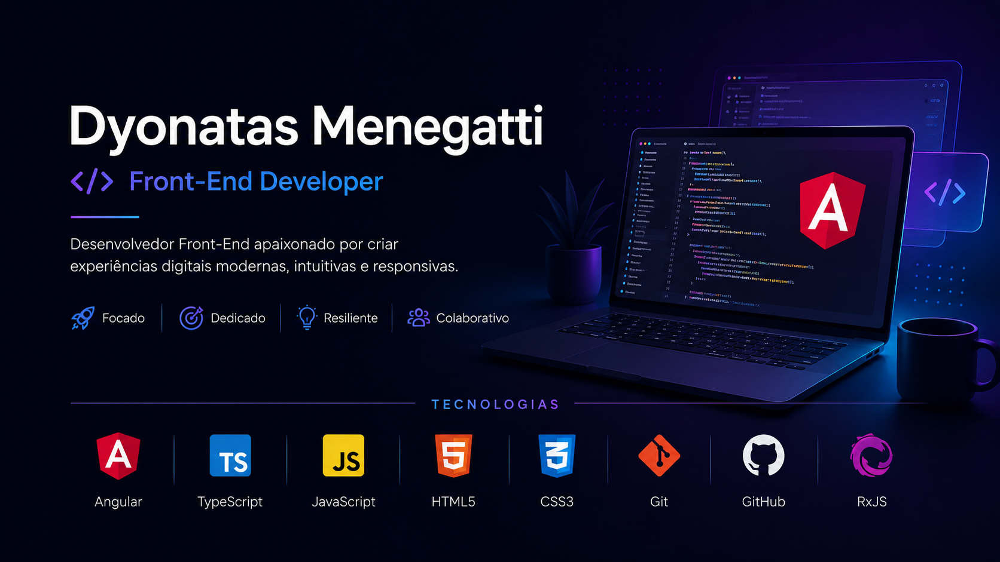

  

<h1 align="center">Dyonatas Menegatti</h1>

  Desenvolvedor Front-End • Angular • TypeScript

  
  
  
  
  

---

## Sobre Mim

Sou formado em Tecnologia em Sistemas para Internet e estou em transição para a área de desenvolvimento Front-End.

Atualmente foco meus estudos em Angular, TypeScript e desenvolvimento de aplicações web modernas, aplicando conceitos como componentização, consumo de APIs REST, autenticação JWT, Guards, Interceptors e boas práticas de arquitetura.

Busco minha primeira oportunidade como Desenvolvedor Front-End para contribuir com projetos reais e continuar evoluindo profissionalmente.

---

## 🚀 Tecnologias & Conhecimentos

<table>
<tr>
<td width="50%" valign="top">

### 💻 Stack Principal

#### 🟢 Avançado

#### 🟡 Intermediário

#### 🔵 Iniciante

</td>

<td width="50%" valign="top">

### 🚀 Conhecimentos

#### Front-End

#### Angular

#### Ferramentas

</td>
</tr>
</table>

---

## 🚀 Projetos em Destaque

<table>
<tr>

<td width="33%" valign="top">

### 🎮 PlayStation Store

Clone da PlayStation Store desenvolvido com Angular.

**Tecnologias**
- Angular
- TypeScript
- HTML5
- CSS3

**Conceitos**
- Componentização
- @Input
- Responsividade
- Reutilização de Componentes

🔗 <a href="https://github.com/Dyonatas-Menegatti/store">Ver Projeto</a>

</td>

<td width="33%" valign="top">

### 🧠 BuzzFeed Quiz

Quiz dinâmico inspirado no BuzzFeed.

**Tecnologias**
- Angular
- TypeScript
- JSON

**Conceitos**
- Renderização Dinâmica
- Manipulação de JSON
- Componentização
- Lógica de Resultados

🔗 <a href="https://github.com/Dyonatas-Menegatti/projeto-buzzfeed">Ver Projeto</a>

</td>

<td width="33%" valign="top">

### 🐱 Pokédex

Aplicação consumindo a PokéAPI.

**Tecnologias**
- Angular
- TypeScript
- RxJS

**Conceitos**
- APIs REST
- Busca Dinâmica
- Tratamento de Dados
- Componentes Reutilizáveis

🔗 <a href="https://github.com/Dyonatas-Menegatti/Estudo-ANGULAR/tree/main/Services%20e%20Pipes/service">Ver Projeto</a>

</td>

</tr>
</table>

---

## 📈 Atividade no GitHub

  

  <i>Construindo conhecimento através de projetos e prática contínua.</i>

---

## 📚 Atualmente Estudando

---

## Contato

---

  <i>"Transformando aprendizado em projetos e projetos em oportunidades."</i>

